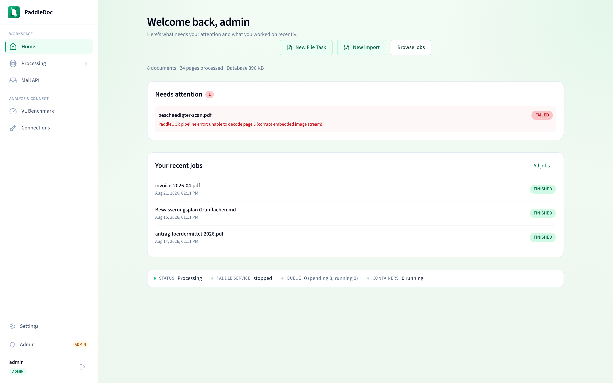
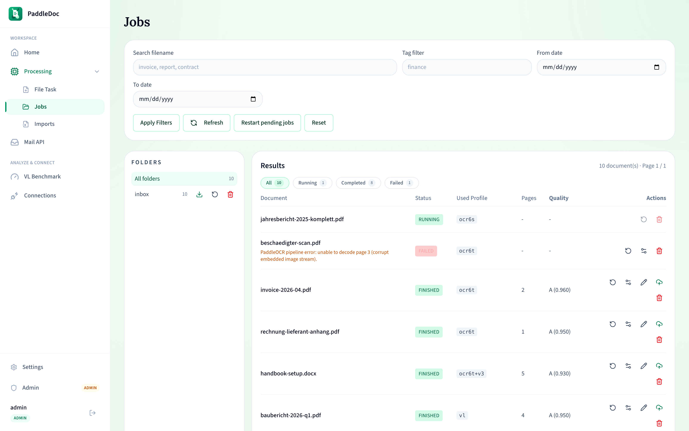
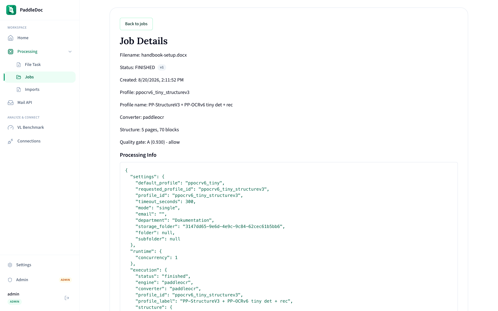

# PaddleDoc

PaddleDoc is a document processing platform powered by PaddleOCR that converts PDFs, Office files, and images into structured Markdown for RAG pipelines.

It is built for teams that need reliable ingestion quality, searchable outputs, and simple deployment options from standalone NAS Docker to Kubernetes.

## Why PaddleDoc

Managing OCR and document normalization at scale gets messy fast. PaddleDoc gives you one workflow for ingestion, extraction, quality scoring, and retrieval-ready output.

- RAG-first Markdown output with consistent structure
- Multiple OCR and vision profiles (fast OCR, layout-aware, VL, OpenAI-compatible)
- Folder and tag organization for search and retrieval workflows
- Queue-based processing with backend + worker separation
- Optional password protection and versioned markdown edits

## Get Started

Choose your deployment mode:

| Mode | Best for | Command |
|---|---|---|
| Standalone Docker | Local server or NAS (UGREEN/QNAP/Synology) | `docker compose -f docker-compose.nas.yml up -d` |
| Docker (Dev/Single Host) | Local development with local builds | `docker compose up --build` |
| Docker + NVIDIA GPU | Windows Docker Desktop with GPU-enabled worker profile | `docker compose -f docker-compose.yml -f docker-compose.gpu.yml up -d --build` |
| Kubernetes (Helm) | k3s/k8s clusters and scale-out deployments | `helm upgrade --install PaddleDoc ./charts/paddledoc -n PaddleDoc --create-namespace` |

### Standalone NAS (No Kubernetes)

Use prebuilt GHCR images and persistent local folders.

```bash
docker compose -f docker-compose.nas.yml up -d
```

Before first production run, set strong credentials/environment values:

```bash
POSTGRES_USER=PaddleDoc
POSTGRES_PASSWORD=change-this
POSTGRES_DB=PaddleDoc
PaddleDoc_TAG=latest
NEXT_PUBLIC_API_URL=http://NAS_IP:8000
```

Endpoints:

- Frontend: `http://NAS_IP:3000`
- Backend: `http://NAS_IP:8000`

### Docker (Local Build)

```bash
docker compose up --build
```

Endpoints:

- Frontend: `http://localhost:3000`
- Backend: `http://localhost:8000`

### Kubernetes (Helm)

Quick install from local chart:

```bash
helm upgrade --install PaddleDoc ./charts/paddledoc \
  --namespace PaddleDoc --create-namespace
```

Install from GHCR OCI chart:

```bash
helm install PaddleDoc oci://ghcr.io/bl0rb/charts/paddledoc --version 0.2.0 \
  --namespace PaddleDoc --create-namespace
```

More chart options and examples are in [charts/paddledoc/README.md](charts/paddledoc/README.md).

## Core Features

- Upload via drag and drop or file picker
- Supported formats: PDF, DOCX, PPTX, XLSX, PNG, JPG, JPEG
- Job lifecycle: `PENDING -> RUNNING -> FINISHED / FAILED`
- Folder tree navigation and deletion by folder
- Search and filtering by filename, tags, date range
- Global statistics and runtime status (CPU/GPU)
- Versioned markdown editing on job detail page
- Password-gated view/download/edit/delete per job
- OpenAI-compatible page-by-page vision profile

## OCR Profiles

| Profile | Typical Use |
|---|---|
| PP-OCRv6 Tiny | Fastest throughput, lowest resource usage |
| PP-OCRv6 Small | Balanced speed and quality |
| PP-OCRv6 Medium | Higher OCR quality |
| PP-StructureV3 variants | Stronger table/layout extraction |
| PaddleOCR-VL 1.6 (0.9B) | Rich document understanding, best on GPU |
| OpenAI-compatible Vision API | Route each page to OpenAI-compatible endpoint |

## Product Walkthrough

### Home (`/`)



Shows system health, selected runtime (CPU/GPU), and global job statistics.

### Processing (`/processing`)


1. Choose single-file or collection flow
2. Add metadata (email, department, folder/subfolder, tags, optional password)
3. Select OCR profile
4. Upload and start processing


### Jobs (`/jobs`)



Browse all jobs, filter by folder/tags/date/filename, and open detailed results.

### Job Detail (`/jobs/{id}`)



Review metadata and processing info, preview or edit markdown, and download output.

## API Quickstart

Common endpoints:

- `POST /api/v1/upload`
- `GET /api/v1/jobs`
- `GET /api/v1/jobs/{job_id}`
- `GET /api/v1/jobs/{job_id}/preview`
- `GET /api/v1/jobs/{job_id}/download`
- `PUT /api/v1/jobs/{job_id}/save`
- `DELETE /api/v1/jobs/{job_id}`
- `GET /api/v1/stats`
- `GET /api/v1/health`
- `GET /api/v1/paddle/status`
- `GET /api/v1/paddle/settings`
- `PUT /api/v1/paddle/settings`
- `GET /api/v1/paddle/capabilities`

Upload using the OpenAI-compatible vision profile:

```bash
curl -F "file=@invoice.pdf" -F "profile_id=openai_vision" http://localhost:8000/api/v1/upload
```

## n8n Integration

Use HTTP Request nodes with a simple upload -> poll -> fetch pattern.

```mermaid
flowchart LR
   A[Document Source\nPDF DOCX PPTX XLSX PNG JPG] --> B[n8n Trigger\nWebhook / Schedule / Drive Watch]
   B --> C[n8n HTTP Request\nPOST /api/v1/upload]
   C --> D[PaddleDoc Queue\nCelery + Worker]
   D --> E[PaddleOCR Processing\nStructured Markdown Output]
   E --> F[n8n Poll Loop\nGET /api/v1/jobs/job-id]
   F --> G[n8n Fetch Result\nGET preview or download]
   G --> H[RAG Ingestion\nChunk + Embed + Index]
   H --> I[Retrieval + Answering\nVector Search + LLM]
```



n8n URL choice:

- n8n inside Docker with PaddleDoc: `http://backend:8000`
- n8n on host machine: `http://localhost:8000`

## Deployment and Runtime Notes

### Architecture

```text
frontend  (Next.js + TypeScript + Tailwind + framer-motion)
backend   (FastAPI + SQLAlchemy + Alembic + Celery)
postgres  (default in Docker compose)
redis     (queue/broker)
worker    (Celery worker)
```

Storage layout:

```text
backend/storage/uploads/single/<job_id>
backend/storage/uploads/collections/<collection_id>/<job_id>
backend/storage/results/single/<job_id>
backend/storage/results/collections/<collection_id>/<job_id>
backend/storage/results/.../edited
```

### GPU Runtime (Windows + NVIDIA)

Use the GPU override file:

```powershell
Copy-Item .env.example .env
docker compose -f docker-compose.yml -f docker-compose.gpu.yml up -d --build
```

Behavior summary:

- Worker image includes `paddlepaddle-gpu`
- Runtime auto-detects CUDA and falls back to CPU
- GPU override switches default profile to `paddlevl_1_6_0_9b`
- Uses safer worker settings for CUDA stability (`solo`, concurrency `1`)

### Worker Scaling and Tuning

Scale workers:

```bash
docker compose up --build -d --scale worker=2
```

Memory-constrained baseline:

- `WORKER_MEMORY_LIMIT=2g` to `3g`
- `CELERY_WORKER_CONCURRENCY=1`
- `CELERY_MAX_TASKS_PER_CHILD=5`
- `OMP_NUM_THREADS=1`
- `ONNXRUNTIME_INTRA_OP_NUM_THREADS=1`

## OpenAI-Compatible Vision Profile

PaddleDoc includes `openai_vision`, which sends each page image to an OpenAI-compatible Chat Completions endpoint and assembles markdown output.

Environment variables:

```dotenv
OPENAI_API_BASE_URL=https://api.openai.com
OPENAI_API_BEARER_TOKEN=sk-your-key-here
```

Ollama example:

```dotenv
OPENAI_API_BASE_URL=http://host.docker.internal:11434
OPENAI_API_BEARER_TOKEN=ollama
```

LiteLLM/proxy example:

```dotenv
OPENAI_API_BASE_URL=http://litellm:4000
OPENAI_API_BEARER_TOKEN=sk-litellm-key
```

Apply changes without rebuilding images:

```bash
docker compose up -d --no-deps backend worker
```

## Publishing to GHCR

Published images:

- `ghcr.io/bl0rb/PaddleDoc-backend`
- `ghcr.io/bl0rb/PaddleDoc-worker`
- `ghcr.io/bl0rb/PaddleDoc-frontend`

### Image publishing (automated)

Workflow: `.github/workflows/publish-ghcr-images.yml`

Trigger publish via git tag:

```bash
git tag v0.2.0
git push origin v0.2.0
```

This publishes multi-arch images (`linux/amd64`, `linux/arm64`) with tags:

- `0.2.0`
- `latest`

### Image publishing (manual)

```powershell
echo $env:GHCR_PAT | docker login ghcr.io -u bl0rb --password-stdin
./scripts/publish-ghcr-images.ps1 -Tag 0.2.0 -AlsoLatest
```

### Helm chart publishing (automated)

Workflow: `.github/workflows/publish-ghcr-helm-chart.yml`

On `v*` tags, the chart is packaged and pushed to:

- `oci://ghcr.io/bl0rb/charts`

## Troubleshooting

### Dashboard loads but stats/profiles/jobs stay empty (Windows)

Symptom: UI loads but API requests to localhost fail intermittently due to WSL2/IPv6 loopback forwarding.

Fix backend port forward:

```powershell
docker compose -f docker-compose.yml -f docker-compose.gpu.yml up -d --force-recreate --no-deps backend
```

IPv4 health check:

```powershell
curl.exe -s -o NUL -w "%{http_code}\n" http://127.0.0.1:8000/api/v1/health
```

## Local Development

Backend:

```bash
cd backend
python -m pip install -r requirements.txt
pytest -q
uvicorn app.main:app --reload
```

Frontend:

```bash
cd frontend
npm install
npm run build
npm run dev
```

Migrations:

- `backend/alembic/versions/0001_init.py`
- `backend/alembic/versions/0002_add_password_protection.py`
- `backend/alembic/versions/0002_job_blob_tags.py`
- `backend/alembic/versions/0002_job_processing_info.py`

## Roadmap

### RAG Quality Foundation

- [ ] Define measurable quality and retrieval benchmarks
- [x] Grade A/B/C document quality gate
- [ ] Add a regression-focused RAG evaluation harness

### Reliability and Operations

- [ ] Add deeper observability (queue depth, latency, retries, failures)
- [ ] Add stronger governance (audit logs, stricter validation, RBAC)

### Delivery and Workflow

- [x] Automate multi-arch GHCR image publishing on release tags
- [x] Automate Helm OCI chart publishing to GHCR on release tags
- [x] Add PR CI gates (lint, tests, and build checks) via `.github/workflows/pr-ci.yml`
- [ ] Add image signing/provenance verification and immutable release policy
- [ ] Expand security scanning and SBOM coverage

### Product and Ecosystem

- [ ] Improve batch progress and operator feedback UX
- [ ] Add vector DB export/webhook integrations

### Milestone

- [ ] Ship v0.2.0 with quality + reliability focus
