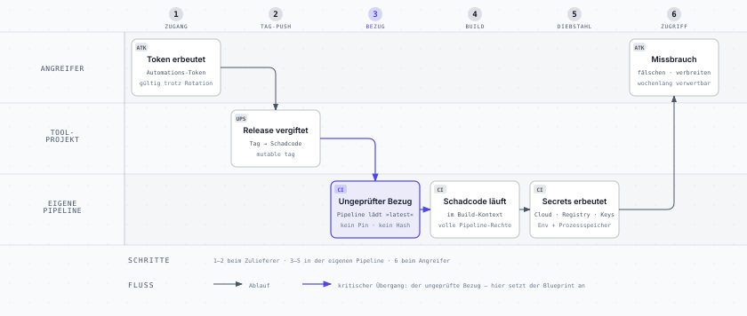

# Supply-Chain-Härtung — Blueprint

> **Zweck dieses Dokuments:** Management-Beschreibung der Härtung unserer Build- und
> Release-Kette gegen Lieferketten-Angriffe. Bewusst produktneutral formuliert —
> als wiederverwendbare Vorlage für jede eigene Anwendung mit automatisierter
> Build- und Release-Pipeline.

---

## 1. Anlass

Im März 2026 wurden über einen kompromittierten Open-Source-Baustein mehr als
2.500 Unternehmen und über 400.000 CI/CD-Pipelines angegriffen. Das Muster: Ein
Werkzeug, das Build-Pipelines ungeprüft in der jeweils „neuesten" Version
beziehen, wurde durch eine bösartige Version ersetzt. Die Schadsoftware lief
dadurch automatisch in den Release-Prozessen der Opfer und stahl dort
Zugangsdaten und Signaturschlüssel — **ohne dass in deren eigenem Code eine
einzige Zeile geändert wurde.**

Der Angriff funktionierte, weil Pipelines Drittkomponenten über *veränderliche*
Verweise beziehen („nimm Version 4", „nimm das Neueste") statt über
*unveränderliche*:

Der entscheidende Moment ist **Schritt 3**: der ungeprüfte Bezug. Alles davor
passiert außerhalb unseres Einflussbereichs — alles danach ist nur noch
Konsequenz. Genau an diesem Übergang setzt der Blueprint an.

## 2. Schutzziel

**Kein Bestandteil unseres Build- und Release-Prozesses darf sich ändern können,
ohne dass diese Änderung bei uns als sichtbare, prüfpflichtige Codeänderung
erscheint.** Ein Angreifer, der einen Zulieferer kompromittiert, darf dadurch
nicht automatisch in unsere Auslieferung gelangen.

## 3. Die fünf Maßnahmen

| Nr. | Maßnahme | Kurzbeschreibung |
|-----|----------|------------------|
| **M1** | Unveränderliche Verweise | Alle in der Pipeline verwendeten Fremdbausteine (CI-Actions) werden auf den kryptografischen Fingerabdruck eines exakten Stands festgeschrieben — statt auf ein Versions-Etikett, das der Anbieter (oder ein Angreifer mit dessen Zugang) nachträglich umhängen kann. |
| **M2** | Echtheitsprüfung für Werkzeuge | Binärwerkzeuge, die die Pipeline zur Laufzeit lädt, werden vor der Ausführung gegen die offiziell veröffentlichte Prüfsumme verifiziert. Ein manipulierter Download bricht den Build ab, statt unbemerkt zu laufen. |
| **M3** | Vollständiges Hash-Locking | Sämtliche Softwarepakete, die in das ausgelieferte Produkt eingebaut werden — einschließlich aller indirekt mitgezogenen Pakete —, sind mit exakter Version *und* Prüfsumme festgeschrieben. Ein ausgetauschtes Paket wird selbst unter gleicher Versionsnummer beim Build erkannt und abgewiesen. Die Festschreibung wird in der identischen Umgebung erzeugt und validiert, in der auch die echten Releases gebaut werden. |
| **M4** | Qualitäts-Gate vor Veröffentlichung | Ein Release wird nur publiziert, wenn der komplette automatisierte Prüflauf (Tests, Lint, Build-Checks) auf exakt dem freizugebenden Stand erfolgreich war. Ein Release-Signal allein reicht nicht mehr aus. |
| **M5** | Kontrollierte Aktualisierung | Ein automatischer Dienst schlägt wöchentlich Aktualisierungen vor — ausschließlich als prüfpflichtige Änderungsanträge, nie als automatische Übernahme. Sicherheit und Aktualität schließen sich damit nicht aus. |

Jede Maßnahme hat einen klaren Durchsetzungsort, eine durchsetzende Instanz und
einen Zeitpunkt — das unterscheidet einen Kontrollkatalog von einer Absichtserklärung:

## 4. Vorher / Nachher

| Bezugspunkt | Vorher | Nachher |
|---|---|---|
| CI-Bausteine (Actions) | Versions-Etikett, nachträglich verschiebbar | Commit-Fingerabdruck, unveränderlich (M1) |
| Laufzeit-Werkzeuge | Download und Ausführung ohne Prüfung | Prüfsummen-Abgleich vor Ausführung (M2) |
| Produkt-Abhängigkeiten | teils ungepinnt, „neueste Version gewinnt" | Version + Prüfsumme, inkl. transitiver Pakete (M3) |
| Release-Auslösung | Release-Signal genügt | Release-Signal **und** grüner Prüflauf (M4) |
| Aktualisierungen | implizit beim nächsten Build | explizite, review-pflichtige Änderungsanträge (M5) |
| Änderung beim Zulieferer | fließt unsichtbar ein | erscheint als sichtbare Codeänderung bei uns |

## 5. Qualitätssicherung der Umsetzung

Jeder festgeschriebene Fingerabdruck wurde unabhängig gegen die Originalquelle
gegengeprüft, jede Prüfsumme gegen die offizielle Veröffentlichung des
Herstellers verifiziert, und die Installierbarkeit der festgeschriebenen
Abhängigkeiten wurde im realen Build-Kontext getestet, bevor die Änderungen
übernommen wurden.

## 6. Wirkung

Der im Vorfall ausgenutzte Angriffsweg — eine kompromittierte Fremdkomponente
fließt automatisch in den nächsten Build — ist geschlossen. Änderungen an
Fremdkomponenten werden von einem unsichtbaren Hintergrundereignis zu einem
sichtbaren, prüfbaren Vorgang. Der laufende Mehraufwand beschränkt sich auf das
Review der automatisch erstellten Aktualisierungsvorschläge.

## 7. Ausbaustufen (optional, empfohlen)

- Schutz der Release-Markierungen und der Hauptentwicklungslinie gegen
  nachträgliches Überschreiben (Plattform-Einstellung, kein Code).
- Festschreiben der Basis-Container-Images per Fingerabdruck.
- Abschaffung von „latest"-Standardwerten in Auslieferungskonfigurationen.
- Kryptografische Signierung der eigenen veröffentlichten Artefakte.

## 8. Anwendung auf eine weitere Anwendung — Checkliste

1. **Inventur:** Alle Stellen erfassen, an denen die Pipeline Fremdes bezieht
   (CI-Bausteine, Werkzeug-Downloads, Paketinstallationen, Basis-Images).
2. **M1:** CI-Bausteine auf Commit-Fingerabdrücke umstellen; Versionsnummer als
   Kommentar für Lesbarkeit beibehalten.
3. **M2:** Für jeden Werkzeug-Download die offizielle Prüfsumme hinterlegen.
4. **M3:** Ungepinnte Installationen auf exakte Versionen heben und in eine
   hash-gelockte Abhängigkeitsdatei überführen; im echten Build-Kontext
   validieren.
5. **M4:** Publish-Pipeline vom vollständigen Prüflauf abhängig machen.
6. **M5:** Automatisierte Update-Vorschläge aktivieren (ohne Auto-Merge) — sie
   pflegen auch die Fingerabdrücke aus M2 und M3 weiter.
7. **Verifikation:** Fingerabdrücke und Prüfsummen unabhängig gegen die
   Originalquellen abgleichen, bevor die Änderungen übernommen werden.

Der Erstaufwand liegt pro Anwendung im Bereich weniger Stunden; der laufende
Aufwand ist das wöchentliche Review der Update-Vorschläge.

---

*Quelle zum Vorfall: CloudSEK, „AI Supply Chain Breach — 2,500 Companies,
434,000 CI/CD Pipelines" (März 2026).
Diagramm-Quellen: [`docs/diagrams/`](diagrams/) — die `.html`-Dateien sind die
bearbeitbaren Originale, die eingebetteten `.svg` daraus exportiert.*
