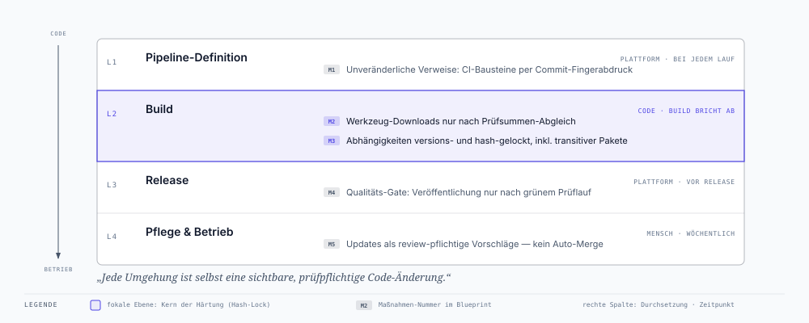

# Supply-Chain-Härtung — Blueprint

> **Zweck dieses Dokuments:** Beschreibung der Härtung unserer Build- und
> Release-Kette gegen Lieferketten-Angriffe. Bewusst produktneutral formuliert —
> als wiederverwendbare Vorlage für jede Anwendung mit automatisierter
> Build- und Release-Pipeline.

## 1. Anlass

Im März 2026 wurden über einen kompromittierten Open-Source-Baustein mehr als
2.500 Unternehmen und über 400.000 CI/CD-Pipelines angegriffen. Das Muster: Ein
Werkzeug, das Build-Pipelines ungeprüft in der jeweils „neuesten" Version
beziehen, wurde durch eine bösartige Version ersetzt. Die Schadsoftware lief
dadurch automatisch in den Release-Prozessen der Opfer und stahl dort
Zugangsdaten und Signaturschlüssel — **ohne dass in deren eigenem Code eine
einzige Zeile geändert wurde.**

Der Angriff funktionierte, weil Pipelines Drittkomponenten über *veränderliche*
Verweise beziehen („nimm Version 4", „nimm das Neueste") statt über
*unveränderliche*:

Der entscheidende Moment ist **Schritt 3**: der ungeprüfte Bezug. Alles davor
passiert außerhalb unseres Einflussbereichs — alles danach ist nur noch
Konsequenz. Genau an diesem Übergang setzt der Blueprint an.

## 2. Schutzziel

**Kein Bestandteil unseres Build- und Release-Prozesses darf sich ändern können,
ohne dass diese Änderung bei uns als sichtbare, prüfpflichtige Codeänderung
erscheint.** Ein Angreifer, der einen Zulieferer kompromittiert, darf dadurch
nicht automatisch in unsere Auslieferung gelangen.

## 3. Die fünf Maßnahmen im Detail

### M1 — Unveränderliche Verweise für Pipeline-Bausteine

**Das Problem.** CI-Pipelines setzen sich aus Fremdbausteinen zusammen
(Checkout, Build-Werkzeuge, Publish-Schritte), die üblicherweise über
Versions-Etiketten wie `@v4` referenziert werden. Ein solches Etikett ist
technisch nur ein *verschiebbarer Zeiger*: Der Anbieter — oder ein Angreifer
mit dessen Zugangsdaten — kann es jederzeit auf einen anderen Stand umhängen,
und jede Pipeline, die es referenziert, führt beim nächsten Lauf ungefragt den
neuen Code aus. Genau dieses Umhängen bereits vergebener Versions-Etiketten war
der Kern des Vorfalls; es gab davor schon reale Fälle bei verbreiteten
CI-Bausteinen.

**Die Maßnahme.** Jeder Fremdbaustein wird auf den *kryptografischen
Fingerabdruck* (Commit-Hash) eines exakten, geprüften Stands festgeschrieben.
Der Fingerabdruck kann nicht umgehängt werden: Er *ist* der Inhalt. Die
menschenlesbare Version bleibt als Kommentar daneben stehen, damit die Referenz
lesbar bleibt. Wichtig ist Vollständigkeit: Die Regel gilt für *alle*
Pipelines — gerade die unscheinbaren (Doku-Builds, Hilfs-Workflows) laufen mit
denselben Rechten wie die prominenten.

**Wirkung und Aufwand.** Ein kompromittierter Anbieter kann unsere Pipeline
nicht mehr erreichen, ohne dass bei uns eine sichtbare Änderung ansteht.
Einmaliger Umstellungsaufwand pro Anwendung: unter einer Stunde; die laufende
Pflege übernimmt die Automatik aus M5.

### M2 — Echtheitsprüfung für heruntergeladene Werkzeuge

**Das Problem.** Pipelines laden zur Laufzeit Binärwerkzeuge herunter
(Paketier-Tools, Deployment-Helfer) und führen sie direkt aus. Die
Transportverschlüsselung (HTTPS) schützt dabei nur den *Weg*, nicht die
*Quelle*: Wird der Download-Server oder das Release-Artefakt selbst
kompromittiert, liefert die verschlüsselte Verbindung brav das manipulierte
Werkzeug aus — mitten in eine Pipeline, die anschließend mit
Veröffentlichungs-Rechten weiterarbeitet.

**Die Maßnahme.** Für jedes zur Laufzeit geladene Werkzeug wird die vom
Hersteller *separat veröffentlichte* Prüfsumme (SHA-256) im Pipeline-Code
hinterlegt. Vor der Ausführung wird der Download gegen diese Prüfsumme
verifiziert; bei Abweichung bricht der Build hart ab („fail closed"). Ein
Werkzeug-Update ist damit automatisch ein sichtbarer Zwei-Zeilen-Diff:
neue Version, neue Prüfsumme.

**Wirkung und Aufwand.** Ein manipuliertes Artefakt — ob durch kompromittierte
Distributions-Infrastruktur oder ausgetauschtes Release — wird erkannt, *bevor*
es ausgeführt wird. Aufwand: wenige Minuten pro Werkzeug, einmalig.

### M3 — Vollständiges Hash-Locking der Produkt-Abhängigkeiten

**Das Problem.** Das ausgelieferte Produkt besteht zum Großteil aus fremden
Softwarepaketen — und zwar nicht nur den direkt benannten, sondern einem Baum
aus Dutzenden bis Hunderten *transitiv* mitgezogenen Paketen. Jede ungepinnte
Stelle in diesem Baum bedeutet: Der nächste Build kann anderen Code enthalten
als der letzte, ohne dass irgendjemand etwas geändert hat. Der Vorfall hat
zusätzlich gezeigt, dass Paket-Ökosysteme Code *bereits bei der Installation*
ausführen können — ein vergiftetes Paket muss nie importiert werden, um zu
wirken.

**Die Maßnahme.** Eine Lock-Datei schreibt den *kompletten* Abhängigkeitsbaum
fest: jedes Paket mit exakter Version *und* den Prüfsummen seiner Artefakte.
Die Installation läuft im strikten Modus: Jedes Artefakt, dessen Prüfsumme
fehlt oder abweicht, bricht den Build ab — auch bei *gleichbleibender
Versionsnummer*. Das schließt die zweite, subtilere Angriffsklasse: den
Austausch eines bereits veröffentlichten Artefakts.

Zwei Praxisdetails entscheiden über die Belastbarkeit: **Erstens** wird die
Lock-Datei in exakt der Umgebung erzeugt und validiert, in der auch die echten
Releases gebaut werden (gleiches Betriebssystem, gleiche Architektur, gleicher
Interpreter) — Abhängigkeitsauflösung ist plattformabhängig, und eine auf dem
Entwickler-Laptop erzeugte Festschreibung kann im Release-Build anders
ausfallen. **Zweitens** deckt die Auflösung reale Widersprüche auf: In unserem
Fall erklärte die neueste Version eines zentralen Pakets Anforderungen, die
sich mit denen seiner eigenen Unterabhängigkeit ausschlossen — der bisherige
ungepinnte Build hatte diesen Konflikt jahrelang stillschweigend „irgendwie"
aufgelöst. Das Lock macht solche Zustände sichtbar und entscheidbar, statt sie
dem Zufall des jeweiligen Installationslaufs zu überlassen.

**Wirkung und Aufwand.** Build-Ergebnisse werden reproduzierbar; weder eine
bösartige neue Version noch ein ausgetauschtes altes Artefakt gelangen
unbemerkt ins Produkt. Einmaliger Aufwand: einige Stunden inklusive Validierung
im Build-Kontext; danach pflegt M5 die Datei weiter.

### M4 — Qualitäts-Gate vor jeder Veröffentlichung

**Das Problem.** In vielen Pipelines genügt ein einziges Signal — das Setzen
einer Release-Markierung —, um die Veröffentlichung anzustoßen. Der Vorfall
hat gezeigt, dass genau dieses Signal fälschbar ist. Und selbst ohne Angreifer
gilt: Ein Release, das ungetestet hinausgeht, ist ein Betriebsrisiko.

**Die Maßnahme.** Die Veröffentlichungs-Pipeline führt vor dem eigentlichen
Publizieren den kompletten automatisierten Prüflauf aus — Tests, statische
Analyse, Build-Checks — und zwar auf *exakt dem Stand*, der veröffentlicht
werden soll. Erst ein vollständig grüner Lauf schaltet die
Veröffentlichungs-Schritte frei. Das Release-Signal allein bewegt nichts mehr.

**Wirkung und Aufwand.** Ein manipulierter oder schlicht defekter Stand kann
nicht mehr „still" veröffentlicht werden. Kosten: wenige Minuten zusätzliche
Laufzeit pro Release — die genau der Prüfung dienen, für die es das Release-
Verfahren gibt.

### M5 — Kontrollierte statt automatischer Aktualisierung

**Das Problem.** Festgeschriebene Stände veralten. Wer Pinning ohne
Aktualisierungs-Prozess einführt, tauscht das Lieferketten-Risiko gegen ein
Sicherheits-Risiko durch veraltete Komponenten — und wer Updates automatisch
übernimmt, reißt die gerade geschlossene Tür wieder auf: Der Vorfall
verbreitete sich exakt über die ungeprüfte Übernahme des „Neuesten".

**Die Maßnahme.** Ein automatischer Dienst prüft wöchentlich alle
festgeschriebenen Bezüge — Pipeline-Bausteine, Produkt-Abhängigkeiten,
Basis-Images — und erstellt für jede verfügbare Aktualisierung einen
*prüfpflichtigen Änderungsantrag*: sichtbarer Diff, Verweis auf die
Release-Notes, automatischer Testlauf. Übernommen wird ausschließlich nach
menschlichem Review; automatisches Zusammenführen ist deaktiviert. Der Dienst
pflegt dabei auch die Fingerabdrücke aus M1 und die Lock-Dateien aus M3 —
er macht die Härtung dauerhaft betreibbar, statt sie verrotten zu lassen.

**Wirkung und Aufwand.** Sicherheit und Aktualität schließen sich nicht mehr
aus. Laufender Aufwand: das wöchentliche Review der Vorschläge — Minuten, nicht
Stunden, und jede investierte Minute ist dokumentierte Sorgfalt.

### Durchsetzungsorte im Überblick

Jede Maßnahme hat einen klaren Durchsetzungsort, eine durchsetzende Instanz und
einen Zeitpunkt — das unterscheidet einen Kontrollkatalog von einer
Absichtserklärung:

## 4. Vorher / Nachher

| Bezugspunkt | Vorher | Nachher |
|---|---|---|
| CI-Bausteine (Actions) | Versions-Etikett, nachträglich verschiebbar | Commit-Fingerabdruck, unveränderlich (M1) |
| Laufzeit-Werkzeuge | Download und Ausführung ohne Prüfung | Prüfsummen-Abgleich vor Ausführung (M2) |
| Produkt-Abhängigkeiten | teils ungepinnt, „neueste Version gewinnt" | Version + Prüfsumme, inkl. transitiver Pakete (M3) |
| Release-Auslösung | Release-Signal genügt | Release-Signal **und** grüner Prüflauf (M4) |
| Aktualisierungen | implizit beim nächsten Build | explizite, review-pflichtige Änderungsanträge (M5) |
| Änderung beim Zulieferer | fließt unsichtbar ein | erscheint als sichtbare Codeänderung bei uns |

## 5. Qualitätssicherung der Umsetzung

Jeder festgeschriebene Fingerabdruck wurde unabhängig gegen die Originalquelle
gegengeprüft, jede Prüfsumme gegen die offizielle Veröffentlichung des
Herstellers verifiziert, und die Installierbarkeit der festgeschriebenen
Abhängigkeiten wurde im realen Build-Kontext getestet, bevor die Änderungen
übernommen wurden. Der erste echte Release nach der Umstellung lief vollständig
durch die gehärtete Kette — inklusive Qualitäts-Gate und hash-verifizierter
Installation aller festgeschriebenen Pakete.

## 6. Grenzen und Restrisiken

Ehrlichkeit gehört zu einem belastbaren Sicherheitskonzept. Was dieser
Blueprint *nicht* leistet:

- **Kompromittierung vor dem Festschreiben.** Wer einen Stand pinnt, der
  bereits bösartig war, pinnt den Schaden mit. Die Maßnahmen frieren Vertrauen
  ein — sie erzeugen es nicht. Das Review neuer Stände (M5) bleibt der Ort, an
  dem Vertrauen entsteht.
- **Qualität des menschlichen Reviews.** M5 ersetzt die automatische Übernahme
  durch eine menschliche Entscheidung. Wird jeder Vorschlag ungelesen
  bestätigt, ist der Gewinn dahin.
- **Kompromittierung der eigenen Zugänge.** Wer Schreibrechte auf unser Repo
  oder unsere Registry erbeutet, umgeht die Lieferketten-Kontrollen. Dagegen
  wirken andere Schichten: kurzlebige Tokens mit minimalen Rechten,
  Tag-/Branch-Schutz, Zwei-Faktor-Authentisierung.
- **Verhalten zur Laufzeit.** Die Maßnahmen sichern den Weg *in* das Artefakt.
  Was ein legitim eingebautes Paket zur Laufzeit tut, adressieren sie nicht.

## 7. Ausbaustufen (optional, empfohlen)

- Schutz der Release-Markierungen und der Hauptentwicklungslinie gegen
  nachträgliches Überschreiben (Plattform-Einstellung, kein Code).
- Festschreiben der Basis-Container-Images per Fingerabdruck.
- Abschaffung von „latest"-Standardwerten in Auslieferungskonfigurationen.
- Kryptografische Signierung der eigenen veröffentlichten Artefakte.

## 8. Anwendung auf eine weitere Anwendung — Checkliste

1. **Inventur:** Alle Stellen erfassen, an denen die Pipeline Fremdes bezieht
   (CI-Bausteine, Werkzeug-Downloads, Paketinstallationen, Basis-Images).
2. **M1:** CI-Bausteine auf Commit-Fingerabdrücke umstellen; Versionsnummer als
   Kommentar für Lesbarkeit beibehalten.
3. **M2:** Für jeden Werkzeug-Download die offizielle Prüfsumme hinterlegen.
4. **M3:** Ungepinnte Installationen auf exakte Versionen heben und in eine
   hash-gelockte Abhängigkeitsdatei überführen; im echten Build-Kontext
   validieren.
5. **M4:** Publish-Pipeline vom vollständigen Prüflauf abhängig machen.
6. **M5:** Automatisierte Update-Vorschläge aktivieren (ohne Auto-Merge) — sie
   pflegen auch die Fingerabdrücke aus M1 und die Locks aus M3 weiter.
7. **Verifikation:** Fingerabdrücke und Prüfsummen unabhängig gegen die
   Originalquellen abgleichen, bevor die Änderungen übernommen werden.

Der Erstaufwand liegt pro Anwendung im Bereich weniger Stunden; der laufende
Aufwand ist das wöchentliche Review der Update-Vorschläge.

---

*Quelle zum Vorfall: CloudSEK, „AI Supply Chain Breach — 2,500 Companies,
434,000 CI/CD Pipelines" (März 2026).*
